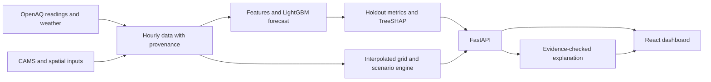

<div align="center">
  
  <h1>AirTwin</h1>
  <p>See the air. Test what could change it.</p>
  <p>An environmental digital twin for Pune and Pimpri-Chinchwad, with a separate Maharashtra forecast view.</p>
  <p>
    <a href="https://github.com/RajvardhanPatil07/AirTwin/actions/workflows/ci.yml"></a>
    &nbsp; <a href="#run-it-locally">Run locally</a> · <a href="#what-you-can-explore">Explore the dashboard</a> · <a href="#how-to-read-the-results">Read the evidence</a>
  </p>
</div>


*Capture of the current interface. The snapshot in the image is historical; check timestamps and source labels in the running app.*

AirTwin brings station readings, a 72-hour PM2.5 outlook, model explanations, and intervention comparisons into one place. It helps you ask where pollution is high, what the forecast suggests, and how assumed traffic, industry, or dust controls compare. It does **not** measure the effect of a real policy.

## What you can explore

| View | What it shows | Read it as |
| --- | --- | --- |
| Map and timeline | Station points, a 12×12 interpolated grid, and forecast playback | Stations may be observed; grid cells and future frames are modeled |
| Forecast and backtest | PM2.5 predictions, uncertainty bands, held-out errors, and baseline comparisons | Forecasts begin at the latest available data timestamp |
| Sources | Estimated traffic, industry, dust, and background shares | Assumption-based proxies, not measured source apportionment |
| Scenarios | Three individual cuts and a combined package, ranked by population-weighted reduction | Comparative estimates, not people protected or avoided illness |
| Historical replay | A dated held-out snapshot and its analysis | Historical evidence, not a live reading |
| Ask AirTwin | Explanations grounded in computed outputs and cited evidence IDs | Generated answers are checked for supported values; a labeled summary works without Gemini |

The Pune and PCMC forecast uses LightGBM blended with persistence. The Maharashtra view uses CAMS provider forecasts at reference points; the local model's backtest does not validate that wider view. [Architecture](docs/architecture.md) · [API](docs/api.md) · [Data sources](docs/data_sources.md)

## Run it locally

You need Python 3.11, Node.js 22, and npm. On macOS, LightGBM may also need the OpenMP runtime (`libomp`).

```sh
git clone https://github.com/RajvardhanPatil07/AirTwin.git
cd AirTwin
python3.11 -m venv .venv311
source .venv311/bin/activate
python -m pip install -r backend/requirements.txt
npm --prefix frontend ci
python scripts/dev.py
```

Open **http://127.0.0.1:5188/**. The API docs are at **http://127.0.0.1:8000/docs**. First startup can take several minutes because the backend trains a model if no matching artifact exists. With no downloaded dataset, it trains on the committed **synthetic sample**. That exercises the workflow but does not reproduce the observed-data results below.

To run the full synthetic pipeline, use `bash scripts/run_all.sh --offline`. To fetch provider data, copy `.env.example` to `.env`, set credentials locally, and run `bash scripts/run_all.sh --live`. The root `.env` is ignored by Git. [Setup and failure cases](docs/troubleshooting.md) · [Pipeline](docs/data_pipeline.md)

The frontend uses the local API through Vite's `/backend` proxy. If the API is unavailable at initial load, it switches to a labeled, illustrative frontend demo. For a hosted frontend, set `VITE_API_BASE_URL` to a public backend URL and allow the frontend origin in `CORS_ORIGINS`. An explicitly empty API URL selects demo mode. [Deployment details](frontend/README.md)

## How to read the results

AirTwin keeps input provenance visible:

| Label | Meaning |
| --- | --- |
| **OBSERVED** | Measured provider readings, such as station PM2.5 |
| **MODELED** | Forecasts, CAMS and weather context, interpolated map cells, or scenario estimates |
| **SYNTHETIC** | Constructed sample or demo inputs |

A measured station value does not turn nearby interpolated cells or intervention estimates into observations. Provider data can arrive late, so a working dashboard is not proof of a current reading. Population estimates for PCMC come from WorldPop 2020 and selected OpenStreetMap geometry; zone activity and intervention responses remain proxies. [Spatial inputs and licenses](docs/spatial_sources.md) · [Assumptions](docs/assumptions.md)

### Recorded model evidence

<!-- computed-model-summary:start -->
Observed-target winter holdout (Nov 2025 – Jan 2026), pooled across stations:

| Horizon | AirTwin MAE (µg/m³) | Persistence MAE | Improvement | p10–p90 coverage |
| --- | --- | --- | --- | --- |
| 1 h | 9.76 | 10.52 | +7.2% | 90.8% |
| 3 h | 19.00 | 22.53 | +15.7% | 86.4% |
| 6 h | 24.56 | 32.53 | +24.5% | 81.1% |
| 12 h | 25.88 | 40.23 | +35.7% | 80.2% |
| 24 h | 20.01 | 21.81 | +8.2% | 90.3% |
| 48 h | 22.59 | 26.06 | +13.3% | 90.1% |
| 72 h | 25.09 | 29.19 | +14.0% | 89.2% |

AirTwin beats persistence at every horizon on this holdout. At 24 h the pooled
MAE is 20.01 µg/m³ (R² 0.56); the training-only seasonal mean scores
52.51. Raw CAMS at the city centroid scores ~48 µg/m³ MAE, so it is
used as a covariate, not as the forecast. Values describe this recorded run, not guarantees.
<!-- computed-model-summary:end -->

These figures belong to one retrospective dataset and its generated [model card](docs/model_card.md). Rebuilding with synthetic data will change the metrics. Some stations lose to persistence even when the pooled result improves. Provider publication delays and fully operational 48/72-hour inputs still need independent evaluation. [Validation protocol](docs/validation_protocol.md) · [Seasonal stress test](docs/evidence/seasonal_validation.md)

Intervention benefit is expressed in **person·µg/m³**, a population-weighted concentration reduction proxy. Scenario bounds come from assumption sensitivity; forecast bands come from model residuals. Neither is a measured health outcome. [Methodology](docs/methodology.md) · [Intervention sensitivity](docs/evidence/intervention_sensitivity.md)

## How it works



The forecast model and the scenario engine answer different questions. TreeSHAP describes predictive features; traffic, industry, and dust shares come from configurable spatial assumptions. [Model design](docs/model_card.md) · [Scenario assumptions](docs/assumptions.md)

## Check the project

```sh
python -m pytest backend/tests -q
npm --prefix frontend test
npm --prefix frontend run lint
npm --prefix frontend run build
npm --prefix frontend run test:sites
python scripts/check_repository.py
python scripts/check_documentation.py
```

CI also runs the offline pipeline without provider keys. [Testing guide](docs/testing.md) · [Recorded verification](docs/verification.md)

## Find your way around

| Path | Purpose |
| --- | --- |
| [`backend/app`](backend/app) | FastAPI routes, forecasting, explanations, and scenarios |
| [`backend/scripts`](backend/scripts) | Fetch, build, train, and validation commands |
| [`frontend/src`](frontend/src) | React dashboard and labeled demo engine |
| [`config/assumptions.yaml`](config/assumptions.yaml) | Scenario assumptions |
| [`data/sample`](data/sample) | Offline sample and sourced spatial inputs |
| [`docs`](docs) | Evidence, architecture, data provenance, and demo notes |

Contributions are welcome through [CONTRIBUTING.md](CONTRIBUTING.md); report security issues through [SECURITY.md](SECURITY.md). Data and map attribution are documented in [data sources](docs/data_sources.md). No project-wide software license has been selected.
