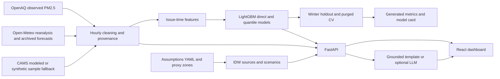

<div align="center">
  
  <h1>AirTwin PCMC</h1>
  <p><strong>Predict pollution. Compare actions. Protect people.</strong></p>
  <p>Urban Environmental Digital Twin for Pune & Pimpri-Chinchwad</p>
  <p>HackMatrix 5.0 · ENR-01 · Energy Track · SDGs 3, 11 & 13</p>
  <a href="https://github.com/RajvardhanPatil07/AirTwin/actions/workflows/ci.yml"></a>
</div>

## What AirTwin answers

Pollution maps show where concentrations are high. AirTwin connects that map to
three questions: **what may happen next, what may contribute, and which action
could help more exposed people?** It combines PM2.5 forecasts, historical evidence,
transparent source hypotheses and population-weighted intervention comparison
for Pune and Pimpri-Chinchwad.

**The local system now works end to end:** ingestion → cleaned data → LightGBM →
FastAPI → the existing React dashboard. It also works without keys using explicitly
synthetic sample targets. Source labels and assumptions are part of the product,
not a footnote.

> **Interpret the evidence honestly.** Model skill differs by station; the pooled
> model can lose to persistence. Quantile coverage is measured, not guaranteed.
> Population and zones remain synthetic proxies. Provider readings may be delayed,
> so every view keeps its data timestamp and the app warns about stale snapshots.
> A forecast begins at its available data origin, not automatically at today's clock.

## Dashboard


*Actual application capture. Check the source badges and date in the image;
modeled intervention effects are not measured policy outcomes.*

<details>
<summary>Compact laptop layout</summary>


</details>

## Required outcomes and implementation

| ENR-01 outcome | Implemented | Interpretation |
| --- | --- | --- |
| PM2.5 forecast for a defined area | Direct LightGBM horizons 1–24, 48 and 72; selectable Pune/PCMC stations/cells | Other 25–71-hour points interpolate anchors; origin is data timestamp |
| ≥3 source categories | Traffic, industry, dust and background; YAML-configured proxies | Not measured chemical source apportionment |
| ≥3 interventions | Three individual cuts and an additive combined package | Weather held fixed; pass-through assumptions disclosed |
| Map plus historical validation | 144 IDW cells and Nov–Jan holdout with persistence/seasonal baselines | Read actual metrics and underperformance warnings |
| OBSERVED vs MODELED distinction | Dataset fields, API schemas, badges, hatch layers and warnings | Synthetic population/history are labeled independently |

[Acceptance evidence](docs/acceptance.md) · [Generated model card](docs/model_card.md)
· [Fetched data coverage](docs/data_report.md).

## Start the project

Requirements: **Python 3.11**, **Node.js 22**, npm. On macOS, LightGBM's native
library may require OpenMP (`libomp` via your trusted package manager).

```sh
git clone https://github.com/RajvardhanPatil07/AirTwin.git
cd AirTwin
python3.11 -m venv .venv
source .venv/bin/activate
python -m pip install -r backend/requirements.txt
```

### Fastest backend startup

```sh
python -m uvicorn app.main:app --app-dir backend --host 127.0.0.1 --port 8000
```

The backend loads processed data when available, otherwise the committed synthetic
sample. Missing/mismatched models regenerate before requests are accepted.
First startup can therefore take longer. Swagger: `http://127.0.0.1:8000/docs`.

In a second terminal:

```sh
cd AirTwin/frontend
npm ci
npm run dev
```

Open the URL printed by Vite, normally `http://localhost:5173`. The frontend uses
`http://127.0.0.1:8000` by default. No environmental key is placed in the browser.

### Reproducible offline workflow

```sh
bash scripts/run_all.sh --offline
```

This executes fetch → weather → build → train → serve using the small committed
synthetic sample. The frontend connects to actual trained model execution on
synthetic targets; those results are not real-world accuracy evidence.

### Fetch real environmental data

```sh
cp .env.example .env
# Edit root .env locally: OPENAQ_API_KEY=your_key
bash scripts/run_all.sh --live
```

Never put a key in `.env.example`, frontend variables, chat, screenshots or Git.
The root `.env` is ignored. Open-Meteo needs no key for this prototype workflow.

OpenAQ requests the last 18 months in the AOI. Pagination, bounded retries,
partial downloads, unit checks and provider fallbacks are implemented. Weather
includes centroid reanalysis, current forecast context and archived previous-run
weather aligned to 24/48/72-hour issue times. If observed targets are sparse, the
builder tries CAMS modeled targets; if providers fail, it uses the synthetic sample.
Logs and source fields expose each fallback.

Data refresh is deliberate: rerun the pipeline/training and restart the backend.
There is no background alerting or hidden live polling service. Successful API
access does not guarantee that the provider has published current measurements.

### Frontend-only fallback

If the backend is unavailable, the app switches the entire input set to the
illustrative synthetic frontend engine with **DEMO DATA** and a warning. To select
that mode explicitly, set `VITE_API_BASE_URL=` in `frontend/.env` and restart Vite.
Later API analysis failures show retry instead of mixing real inputs with mocks.

The basemap requires internet. Without tiles, the grid/markers/charts/scenarios
still work with a notice; this is not an offline map-tile cache.

## Explore the demo

1. Select Bhosari or another monitoring location; inspect its source and timestamp.
2. Change three cuts, notice OUTDATED status, then Run scenario.
3. Select individual/combined ranking rows and switch before/after views.
4. Set every cut to zero; concentrations must remain unchanged.
5. Open Sources and its assumptions; then Forecast and its separate TreeSHAP groups.
6. Open Backtest: compare actual/model/persistence, errors and band coverage.
7. Use Historical replay to load a high held-out hour with a visible date banner.
8. Open Ask AirTwin for a grounded actual-output summary; no LLM key is required.

[Three-minute recording script](docs/demo.md).

## Computed model evidence

<!-- computed-model-summary:start -->
| Observed-target winter holdout | Computed value |
| --- | --- |
| MAE | 21.92 µg/m³ |
| RMSE | 33.95 µg/m³ |
| Persistence MAE | 21.81 µg/m³ |
| Improvement over persistence | -0.50% |
| p10–p90 coverage | 78.28% |

The pooled model loses to persistence on this holdout. Bhosari's measured
improvement is 7.09%, with MAE 15.17 µg/m³.
These values describe this recorded run; they are not performance guarantees.
<!-- computed-model-summary:end -->

The model card is generated by train_model.py from held-out output, not typed
accuracy claims. Its dataset fingerprint identifies the run. Regenerating on the
sample produces synthetic metrics; do not treat those as observed city skill.
The table can legitimately show negative improvement.

## Architecture



[Architecture details](docs/architecture.md) · [API contract](docs/api.md).

## ML design

- Gap-aware PM2.5 lags: 1, 2, 3, 6, 12, 24 and 48 hours; issue reading included.
- Past-only rolling mean/std at 6 and 24 hours.
- Target-calendar hour/day/month with cyclical encoding and a winter flag.
- Issue weather, wind u/v, humidity/rain and calm-humid stagnation.
- Archived horizon-weather covariates for 24/48/72 hours where available; otherwise
  issue-weather persistence. BLH stays missing when unavailable.
- Direct mean and alpha 0.1/0.9 quantile LightGBM models.
- Chronological winter holdout when coverage allows; otherwise disclosed last-20% split.
- Horizon-aware purging across stations in TimeSeriesSplit.
- Persistence and training-only seasonal hourly mean baselines.
- Computed MAE/RMSE/R²/improvement/coverage and per-sensor evidence.
- Separate serving refit and held-out models; exact TreeSHAP grouped by feature category.

Reanalysis issue covariates are retrospective, and provider publication delay is
not simulated. Archived horizon forecasts reduce future-weather leakage, but do
not make this a fully operational availability experiment.

## Attribution and intervention math

`background = min(shared-hour 15th percentile, cell baseline)` and
`local_excess = max(baseline − background, 0)`. Local traffic/industry/dust proxy
weights normalize to one; displayed total shares also include background.

```text
ΔPM2.5 = local_excess × Σ(local_weight × cut_fraction) × pass_through
after   = max(background, before − ΔPM2.5)
benefit = Σ(cell_reduction × cell_population)
```

Central pass-through is 0.7; sensitivity uses 0.6–0.8 with ±20% aggregate source
scaling. Combined central benefit equals individual sums before rounding.
Background-inclusive shares are not multiplied by local excess a second time.

Traffic uses assumed corridor/hour profiles, industry uses proximity/upwind cosine,
and dust uses construction proximity/dryness. The hand-drawn zones are synthetic
proxy geometry. Population is synthetic too. Benefit units are **person·µg/m³**,
not people protected, avoided deaths, cumulative dose or measured policy effectiveness.

[Assumptions](docs/assumptions.md) · [Methodology](docs/methodology.md).

## Provenance and uncertainty

| Label | Meaning | Examples |
| --- | --- | --- |
| OBSERVED | Measured provider readings | OpenAQ PM2.5 targets |
| MODELED | Forecast/reanalysis/interpolation/scenario output | LightGBM, CAMS, weather, IDW and shares |
| SYNTHETIC | Constructed development/demo input | Sample targets, population and proxy zones |

Target, weather and population provenance are independent. CAMS remains modeled
after training. Missing target hours are not filled and relabeled observed.
One scalar source label does not erase nested input provenance.

Scenario sensitivity bounds and forecast quantile bands are different quantities.
Forecast coverage is measured in the holdout; low coverage and model losses appear
in the UI. SHAP is feature explanation, not causal source attribution.

## Standout features

**Historical replay:** selects a high held-out target hour, reloads the snapshot
and shows its date/source. Replay forecasts use the pre-holdout 24-hour model;
shorter points interpolate from the issue reading. Full independent archived
forecasts at every replay horizon are not claimed.

**Ask AirTwin:** builds context from actual forecast, TreeSHAP, shares, scenarios
and backtest outputs. Without a key it returns a grounded template. Optional root
environment values: LLM_API_KEY, LLM_BASE_URL and LLM_MODEL for an OpenAI-compatible
provider. The prompt forbids outside numbers; numeric/tag checks reject invalid
output. This is not proof of perfect semantic grounding, and no provider-backed
LLM run has been verified without a configured key.

## Quality checks

```sh
python -m pytest backend/tests -q
cd frontend
npm run lint
npm test
npm run build
npm run test:sites
```

`make check PYTHON=.venv/bin/python` runs the combined checks. CI tests the offline
pipeline and trains on the sample without provider keys. API tests isolate their
model artifacts so they cannot overwrite development models.

`python scripts/check_repository.py` rejects tracked secrets-by-path, generated
outputs and oversized files; it is not a complete credential-content scanner.
Review staged diffs as well. Raw data, processed files, model binaries, environment
files, virtual environments, dependencies, videos and build outputs stay ignored.

[Testing](docs/testing.md) · [Troubleshooting](docs/troubleshooting.md) ·
[Contribution guide](CONTRIBUTING.md).

## Repository structure

```text
AirTwin/
├── .github/                 # CI, issue forms, PR checklist
├── backend/
│   ├── app/main.py          # FastAPI and local CORS
│   ├── app/schemas.py       # Typed response/input provenance
│   ├── app/routers/         # Forecast, backtest, map, sources, scenarios, explain
│   ├── app/services/        # Data, features, ML, spatial, simulation, context
│   ├── scripts/             # Fetch → build → train
│   └── tests/               # Pipeline, leakage, split, math and API tests
├── config/assumptions.yaml  # Central source/intervention weights
├── data/sample/             # Small synthetic offline fixture
├── data/zones.geojson       # Hand-made synthetic proxy geometry
├── docs/                    # Evidence, architecture, API and methodology
├── frontend/src/            # Existing screenshot-matched dashboard
├── scripts/run_all.sh       # Fetch → build → train → serve
└── Makefile
```

## Limits and next milestones

Sparse/delayed observations, station gaps, retrospective weather and domain shifts
limit forecast interpretation. Proximity source shares are not chemical transport
or causal models. Synthetic population cannot support demographic or health claims.
Colors are concentration bands, not a calculated official city AQI. No production
security, regulatory support, health advice or alerting is claimed.

Next: improve skill using training/CV and a new evaluation period; calibrate
intervals; verify real road/industrial/population inputs; strengthen LLM claim
checks; add pollutants and validated alerts. [Roadmap](docs/roadmap.md).

## Sources and licenses

OpenAQ observed readings retain station/provider names. Open-Meteo API data are
CC BY 4.0; retain Open-Meteo/CAMS attribution where used. The current basemap is
© OpenStreetMap contributors, ODbL data with separate tile-use conditions. WorldPop
is planned, not used. Inter is SIL OFL. No downloaded provider dumps are committed.

[Source and license notes](docs/data_sources.md). No project-wide software license
has been chosen by the team; public repository visibility alone is not a license.

## Social impact and team

Intended contributions: **SDG 3** through exposure-aware comparison, **SDG 11**
through transparent urban action scenarios, and **SDG 13** through environmental
data interpretation. No health or policy impact has been measured.

Built for a four-person student team. Repository maintainer:
[Rajvardhan Patil](https://github.com/RajvardhanPatil07). Other member names have
not been provided and are not invented. Suggested responsibilities: data/ML,
API/spatial, frontend and validation/docs/demo. Git history records actual authorship.
