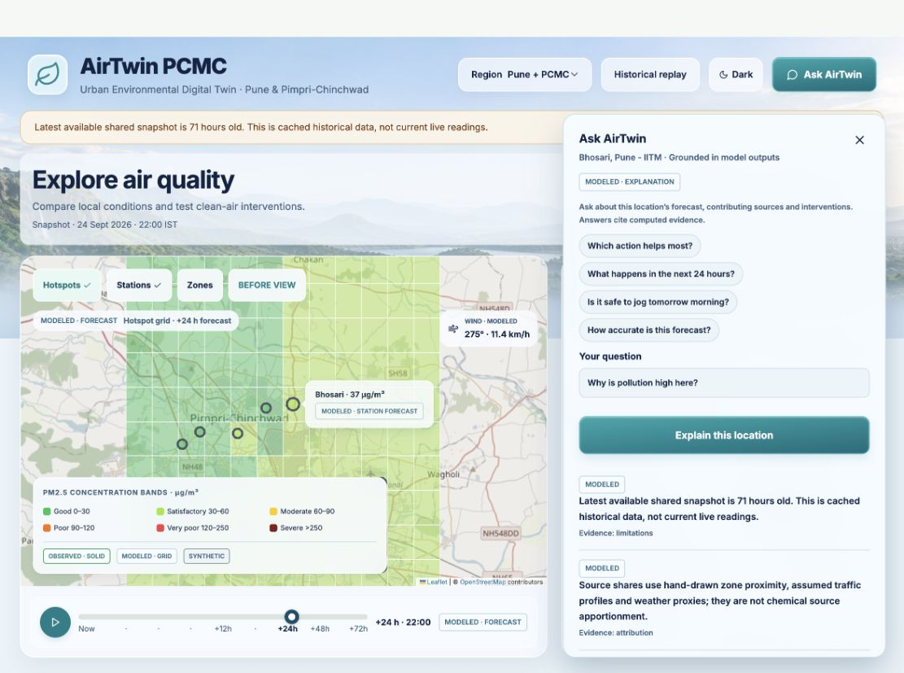
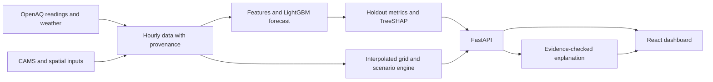

<div align="center">
  
  <h1>AirTwin</h1>
  <p>See the air. Test what could change it.</p>
  <p>An environmental digital twin for Pune and Pimpri-Chinchwad, with a separate Maharashtra forecast view.</p>
  <p>
    <a href="https://github.com/RajvardhanPatil07/AirTwin/actions/workflows/ci.yml"></a>
    &nbsp; <a href="#run-it-locally">Run locally</a> · <a href="#what-you-can-explore">Explore the dashboard</a> · <a href="#how-to-read-the-results">Read the evidence</a> · <a href="#future-directions">Future directions</a>
  </p>
</div>



*Capture of the current interface. The snapshot in the image is historical; check timestamps and source labels in the running app.*

AirTwin brings station readings, a 72-hour PM2.5 outlook, model explanations, and intervention comparisons into one place. It helps you ask where pollution is high, what the forecast suggests, and how assumed traffic, industry, or dust controls compare. It does **not** measure the effect of a real policy.

## What you can explore

| View | What it shows | Read it as |
| --- | --- | --- |
| Map and timeline | Station points, a 12×12 interpolated grid, and forecast playback | Stations may be observed; grid cells and future frames are modeled |
| Forecast and backtest | PM2.5 predictions, uncertainty bands, held-out errors, and baseline comparisons | Forecasts begin at the latest available data timestamp |
| Sources | Estimated traffic, industry, dust, and background shares | Assumption-based proxies, not measured source apportionment |
| Scenarios | Three individual cuts and a combined package, ranked by population-weighted reduction | Comparative estimates, not people protected or avoided illness |
| Historical replay | A dated held-out snapshot and its analysis | Historical evidence, not a live reading |
| Ask AirTwin | Explanations grounded in computed outputs and cited evidence IDs | Generated answers are checked for supported values; a labeled summary works without Gemini |

The current Pune–PCMC view refreshes CAMS/Open-Meteo air-quality and weather forecasts at 25 named area reference points while the backend runs, plus OpenAQ PM2.5 station readings when they pass a 24-hour freshness check. These reference points are modeled samples, not neighborhood monitors. Historical replay uses the separate LightGBM model blended with persistence. The Maharashtra view uses CAMS provider forecasts at reference points; historical model backtests do not validate current provider forecasts. [Architecture](docs/architecture.md) · [API](docs/api.md) · [Data sources](docs/data_sources.md)

## Run it locally

You need Python 3.11, Node.js 22, and npm. On macOS, LightGBM may also need the OpenMP runtime (`libomp`).

```sh
git clone https://github.com/RajvardhanPatil07/AirTwin.git
cd AirTwin
python3.11 -m venv .venv311
source .venv311/bin/activate
python -m pip install -r backend/requirements.txt
npm --prefix frontend ci
python scripts/dev.py
```

Open **http://127.0.0.1:5188/**. The API docs are at **http://127.0.0.1:8000/docs**. First startup can take several minutes because the backend trains a model if no matching artifact exists. With no downloaded dataset, it trains on the committed **synthetic sample**. That exercises the workflow but does not reproduce the observed-data results below.

To run the full synthetic pipeline, use `bash scripts/run_all.sh --offline`. The running backend fetches current Pune–PCMC and Maharashtra provider context hourly when `LIVE_REFRESH_ENABLED=1`. An OpenAQ key enables observed-station discovery; CAMS/Open-Meteo model context does not require that key. Historical PCMC model training remains a separate operation: copy `.env.example` to `.env`, set credentials locally, and run `bash scripts/run_all.sh --live` when you want to rebuild it. The root `.env` is ignored by Git. [Setup and failure cases](docs/troubleshooting.md) · [Pipeline](docs/data_pipeline.md)

For persistent provider history in a hosted backend, provision PostgreSQL and set `DATABASE_URL` on the backend service. Each successful Pune–PCMC and Maharashtra refresh is stored as a timestamped JSONB snapshot, with 30-day retention; the latest database snapshot is used after a restart. Without `DATABASE_URL`, the existing local JSON cache continues to work. `/api/health` reports database connectivity and stored snapshot timestamps. Provider refresh cadence remains controlled by `LIVE_REFRESH_SECONDS` (default one hour); the frontend checks for updated data every minute, but source freshness still depends on the provider.

The frontend uses the local API through Vite's `/backend` proxy. If the API is unavailable at initial load, it switches to a labeled, illustrative frontend demo. For a hosted frontend, set `VITE_API_BASE_URL` to a public backend URL and allow the frontend origin in `CORS_ORIGINS`. An explicitly empty API URL selects demo mode. [Deployment details](frontend/README.md)

## How to read the results

AirTwin keeps input provenance visible:

| Label | Meaning |
| --- | --- |
| **OBSERVED** | Measured provider readings, such as station PM2.5 |
| **MODELED** | Forecasts, CAMS and weather context, interpolated map cells, or scenario estimates |
| **SYNTHETIC** | Constructed sample or demo inputs |

A measured station value does not turn nearby interpolated cells or intervention estimates into observations. Provider data can arrive late, so a working dashboard is not proof of a current reading. Population estimates for PCMC come from WorldPop 2020 and selected OpenStreetMap geometry; zone activity and intervention responses remain proxies. [Spatial inputs and licenses](docs/spatial_sources.md) · [Assumptions](docs/assumptions.md)

### Recorded model evidence

<!-- computed-model-summary:start -->
Observed-target winter holdout (Nov 2025 – Jan 2026), pooled across stations:

| Horizon | AirTwin MAE (µg/m³) | Persistence MAE | Improvement | p10–p90 coverage |
| --- | --- | --- | --- | --- |
| 1 h | 9.76 | 10.52 | +7.2% | 90.8% |
| 3 h | 19.00 | 22.53 | +15.7% | 86.4% |
| 6 h | 24.56 | 32.53 | +24.5% | 81.1% |
| 12 h | 25.88 | 40.23 | +35.7% | 80.2% |
| 24 h | 20.01 | 21.81 | +8.2% | 90.3% |
| 48 h | 22.59 | 26.06 | +13.3% | 90.1% |
| 72 h | 25.09 | 29.19 | +14.0% | 89.2% |

AirTwin beats persistence at every horizon on this holdout. At 24 h the pooled
MAE is 20.01 µg/m³ (R² 0.56); the training-only seasonal mean scores
52.51. Raw CAMS at the city centroid scores ~48 µg/m³ MAE, so it is
used as a covariate, not as the forecast. Values describe this recorded run, not guarantees.
<!-- computed-model-summary:end -->

These figures belong to one retrospective dataset and its generated [model card](docs/model_card.md). Rebuilding with synthetic data will change the metrics. Some stations lose to persistence even when the pooled result improves. Provider publication delays and fully operational 48/72-hour inputs still need independent evaluation. [Validation protocol](docs/validation_protocol.md) · [Seasonal stress test](docs/evidence/seasonal_validation.md)

Intervention benefit is expressed in **person·µg/m³**, a population-weighted concentration reduction proxy. Scenario bounds come from assumption sensitivity; forecast bands come from model residuals. Neither is a measured health outcome. [Methodology](docs/methodology.md) · [Intervention sensitivity](docs/evidence/intervention_sensitivity.md)

## How it works



The forecast model and the scenario engine answer different questions. TreeSHAP describes predictive features; traffic, industry, and dust shares come from configurable spatial assumptions. [Model design](docs/model_card.md) · [Scenario assumptions](docs/assumptions.md)

## Future directions

The next step is to connect four parts of a city decision: **predict, act, measure, and learn**. The ideas below are proposals, not features in this build. Their value would come from testing the whole chain in Pune and PCMC, with the failures visible alongside the successes. [Research notes and source links](docs/research/airtwin-future-directions-2026-09-28.md)

### A policy trial that grades its own prediction

Before a road-dust, traffic, or industrial action begins, a city team could record the planned action, area, dates, cost, and AirTwin's expected change. The system would freeze that prediction, then compare later observations with a suitable untreated area while accounting for weather and trends. The first pilot would need a real action log and enough monitoring on both sides. A simple before-and-after drop would never count as proof of impact; the published result could also say the original scenario was wrong. [EPA's intervention accountability framework](https://assessments.epa.gov/risk/document/%26deid%3D364752)

### A sensor mission planner

Instead of adding sensors wherever installation is easiest, AirTwin could identify locations where a new measurement would most improve a forecast or change an intervention choice. Each suggestion would show the question it answers, expected information gain, and practical siting constraints. A first trial could compare one recommended site with a reference monitor and check whether uncertainty actually fell. Low-cost sensors would require collocation and quality checks before their readings influence decisions. [EPA sensor guidance](https://www.epa.gov/air-sensor-toolbox/how-use-air-sensors-air-sensor-guidebook)

### Cleaner journeys with honest uncertainty

A future route view could compare departure times and walking, cycling, or transit options by estimated exposure, travel time, safe crossings, and accessibility. It should mark which parts of a route have measurements and which rely on a model. The current 12×12 grid is too coarse for street-level advice; this feature would first need a finer, independently tested pollution surface and privacy-conscious route handling. [WHO guidance on personal exposure choices](https://www.who.int/publications/i/item/WHO-EURO-2024-9115-48887-72806)

### An intervention portfolio with a fairness guardrail

City planners could enter a budget and compare packages of dust, traffic, and industrial controls across plausible weather and response assumptions. Results would show estimated gains by neighborhood, cost, and where a citywide average hides a poor outcome for a highly exposed area. An early version could use transparent sensitivity ranges, then replace proxy response factors as local evidence arrives. It would not label modeled concentration reductions as measured health benefits. [WHO on unequal air-pollution exposure](https://www.who.int/teams/environment-climate-change-and-health/air-quality-energy-and-health/sectoral-interventions/ambient-air-pollution/health-equity)

### Independent signals and a forecast flight recorder

For a major intervention, ground readings and wind could be checked against a separate [Sentinel-5P NO₂ product](https://documentation.dataspace.copernicus.eu/APIs/SentinelHub/Data/S5PL2.html). Satellite NO₂ is a broad, different measurement; it cannot be converted into street-level PM2.5 or treated as proof of a local source. Alongside that check, each AirTwin forecast could save its input timestamps, model version, missing sensors, fallbacks, assumptions, and eventual error. A first milestone is a replayable answer to: *what did the system know when it made this recommendation?* If inputs are too stale, it should say so and hold back a detailed recommendation.

These directions depend on new data partnerships, validation, and city participation. The [current roadmap](docs/roadmap.md) tracks nearer-term model and operational work; the [research note](docs/research/airtwin-future-directions-2026-09-28.md) records the evidence and limits behind these longer-term proposals.

## Check the project

```sh
python -m pytest backend/tests -q
npm --prefix frontend test
npm --prefix frontend run lint
npm --prefix frontend run build
npm --prefix frontend run test:sites
python scripts/check_repository.py
python scripts/check_documentation.py
```

CI also runs the offline pipeline without provider keys. [Testing guide](docs/testing.md) · [Recorded verification](docs/verification.md)

## Find your way around

| Path | Purpose |
| --- | --- |
| [`backend/app`](backend/app) | FastAPI routes, forecasting, explanations, and scenarios |
| [`backend/scripts`](backend/scripts) | Fetch, build, train, and validation commands |
| [`frontend/src`](frontend/src) | React dashboard and labeled demo engine |
| [`config/assumptions.yaml`](config/assumptions.yaml) | Scenario assumptions |
| [`data/sample`](data/sample) | Offline sample and sourced spatial inputs |
| [`docs`](docs) | Evidence, architecture, data provenance, and demo notes |

Contributions are welcome through [CONTRIBUTING.md](CONTRIBUTING.md); report security issues through [SECURITY.md](SECURITY.md). Data and map attribution are documented in [data sources](docs/data_sources.md). No project-wide software license has been selected.
