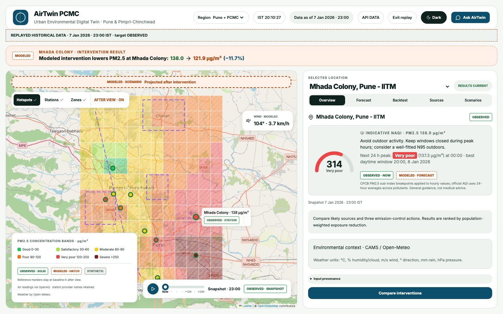
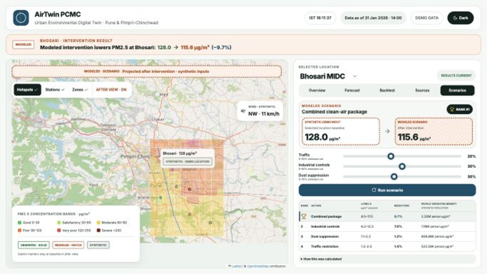
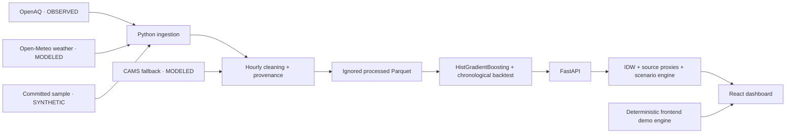

<div align="center">
  
  <h1>AirTwin PCMC</h1>
  <p><strong>Predict pollution. Compare actions. Protect people.</strong></p>
  <p>Urban Environmental Digital Twin for Pune & Pimpri-Chinchwad</p>
  <p>HackMatrix 5.0 · ENR-01 · Energy Track · SDGs 3, 11 & 13</p>
  <a href="https://github.com/RajvardhanPatil07/AirTwin/actions/workflows/ci.yml"></a>
</div>

## What AirTwin is building

A pollution map tells us where air is bad. A useful environmental digital twin
should also help explain likely drivers and compare what could improve it.
AirTwin brings those questions into one map-based workspace for Pune and PCMC:

1. **What might PM2.5 be next?** Compare a forecast with historical evidence.
2. **What might contribute?** Separate regional background from local proxy sources.
3. **Which action could help most?** Compare traffic restrictions, industrial controls
   and dust suppression using population-weighted exposure reduction.

The differentiator is transparency: provenance badges, assumptions next to modeled
results, comparison against persistence, and action rankings that account for the
population exposed. The repository now includes an executable forecasting,
spatial-attribution and scenario backend in addition to the deterministic browser
demo.

> **Current release: frontend demo + ingestion pipeline + executable FastAPI backend.**
> The committed fallback dataset is still **SYNTHETIC**, so the repository does not
> claim measured Pune/PCMC forecast accuracy by default. When adequate observed data
> are available, the backend trains a chronological one-hour PM2.5 model, compares it
> with persistence, serves recursive 24/48/72-hour forecasts, and preserves target
> provenance. Source shares remain transparent proxy estimates, not chemical source
> apportionment or causal policy effects.

## Dashboard preview



*Actual running frontend at 1920×1080. The visible reduction is a computed synthetic
scenario, not a measured intervention effect. Screenshot text is less sharp because
of the browser capture scale; the application uses vector text.*

<details>
<summary>View the compact laptop layout</summary>



*1366×768: ranking rows remain visible; expanded details scroll inside the panel.*

</details>

## Judge-facing implementation status

| ENR-01 outcome | What exists now | What is still needed |
| --- | --- | --- |
| PM2.5 forecast for a defined urban area | Runtime HistGradientBoosting model, chronological backtest, persistence baseline and 24/48/72 recursive serving | Run on adequate observed history before claiming city accuracy |
| ≥3 source categories with assumptions | Backend traffic, industry, dust and regional-background proxy shares | Replace approximate anchors with sourced spatial proxy layers |
| ≥3 pollution reduction actions | Backend traffic, industry and dust actions plus combined package and after-grids | Validate pass-through assumptions with domain evidence |
| Hotspots and historical validation | Backend 12×12 IDW grid + chronological final-20% holdout metrics | Observed winter holdout when provider coverage permits |
| OBSERVED vs MODELED labels | Provenance carried through station, forecast, backtest, grid, attribution and scenario responses | Keep this invariant for future features |

**Do not present a completed UI tab as proof that the corresponding ML/backend
capability exists.** [Full acceptance checklist](docs/acceptance.md).

## Run the working demo

Requirements: Node.js 22 with npm. No API key or Python backend is needed.

```sh
git clone https://github.com/RajvardhanPatil07/AirTwin.git
cd AirTwin/frontend
npm ci
npm run dev
```

Open the local URL printed by Vite (normally `http://localhost:5173`). Keep
`VITE_API_BASE_URL` unset to use the deterministic demo immediately. Fonts are
bundled locally; the OpenStreetMap basemap requires internet. If tiles fail,
the app shows a notice and its grid, markers, charts and scenario controls continue
working. A map without downloaded tiles is not a fully offline basemap.

### Try these interactions

- Select Bhosari MIDC, Chakan MIDC or another demo location.
- Open **Scenarios** and change traffic, industry and dust cuts.
- Click **Run scenario**. The banner, cards, table and map use the same result.
- Click a ranked action to inspect its after-map; switch between before and after.
- Set all cuts to zero and verify there is no concentration reduction.
- Open **Sources** and read assumptions behind the proxy shares.
- Open **Backtest** and see metrics calculated from a synthetic series.
- Open **Forecast** and switch the horizon; read the illustrative-band notice.
- Toggle map layers, select a cell, expand assumptions or switch the theme.

[Frontend guide](frontend/README.md) · [Three-minute demo script](docs/demo.md).

## Run the Python data pipeline

Python 3.11 is the supported development/CI version. Run from the repository root:

```sh
python3.11 -m venv .venv
source .venv/bin/activate
python -m pip install -r backend/requirements.txt
```

### Offline, reproducible path

```sh
bash scripts/pipeline.sh --offline
```

This runs fetch → weather → build using the committed synthetic sample. The result
is `data/processed/dataset.parquet`, ignored by Git. The FastAPI service trains its
small forecasting model at runtime from this processed dataset (or the committed
sample if no processed file exists), so generated model binaries are not committed.

### Optional provider path

```sh
cp .env.example .env
# Edit .env locally and set OPENAQ_API_KEY.
bash scripts/pipeline.sh --live
```

The OpenAQ fetcher requests up to 18 months of hourly PM2.5 inside the AOI, follows
pagination, retries bounded failures/rate limits, and retains partial sensor
results. Weather uses Open-Meteo centroid reanalysis. The builder filters invalid
targets, aggregates station-hours, merges weather, and records provenance.

The initial threshold is one sensor with at least **720 valid hours**. It is a
coverage heuristic, not proof of enough data for training. If observed targets are
sparse, the builder tries recent CAMS model output with matching weather; if this
fails, it uses the synthetic fixture. Logs explicitly name fallbacks.

Only the offline paths and simulated failure paths are verified in this release.
Live provider responses and coverage must be checked before claiming real data.
See [data pipeline](docs/data_pipeline.md) for the schema and failure behavior.

### Optional convenience targets

```sh
make frontend
make pipeline PYTHON=.venv/bin/python
make check PYTHON=.venv/bin/python
```

Backend/API dependencies are separated in `backend/requirements-ml.txt`. To run
the end-to-end backend mode:

```sh
python -m pip install -r backend/requirements-ml.txt
python -m uvicorn backend.app.main:app --reload --port 8000
# In another shell:
cd frontend
VITE_API_BASE_URL=http://localhost:8000 npm run dev
```

With no `VITE_API_BASE_URL`, the frontend intentionally keeps using the deterministic
synthetic browser demo.

## Architecture



The backend path is executable today. The Python sample and frontend fixtures are
still **separate** deterministic fallbacks; setting `VITE_API_BASE_URL` switches the
frontend to the API dataset instead of the browser fixture.

## Technology and responsibility

| Layer | Implemented | Planned |
| --- | --- | --- |
| Frontend | React, Vite, TypeScript, Tailwind, React Leaflet, Recharts, Lucide | Grounded explanation drawer and historical replay |
| Ingestion | Python, pandas, NumPy, requests, python-dotenv, PyArrow | Forecast weather, more station diagnostics |
| Modeling | Runtime scikit-learn gradient boosting, hourly lags/rolling features, chronological holdout, persistence comparison | Longer observed holdout, seasonal baseline, archived future-weather inputs |
| API | FastAPI routes, Pydantic request validation, development CORS, typed frontend adapter | Cache reload endpoint and richer diagnostics |
| Spatial | Backend 12×12 IDW grid, weather-aware traffic/industry/dust proxies, scenario after-grids | Sourced road/industry/construction layers and verified zones |
| Quality | pytest model/spatial/API tests, Vitest, ESLint, TypeScript build, split GitHub Actions jobs | Live-provider evidence tests outside CI |

## Calculation principles

For each cell, `background = min(regional 15th percentile, baseline)` and
`local_excess = max(baseline − background, 0)`. Local traffic/industry/dust weights
sum to one. The intervention engine applies:

```text
reduction = local_excess × Σ(local_weight × emission_cut_fraction) × pass_through
after     = max(background, before − reduction)
benefit   = Σ(cell_reduction × cell_population)
```

The central pass-through is 0.7. Low/high sensitivity uses 0.6/0.8 and ±20% source
scaling. These are assumptions, not confidence bounds from observations.

**Local weights and total concentration shares are different.** Multiplying
background-inclusive shares by local excess would discount local sources twice.
The current demo uses local weights, so combined concentration and exposure
benefits equal the sum of individual actions before display rounding.

Benefit is in **person·µg/m³**, not a count of people protected, a health-risk
estimate, or a cumulative dose. [Equations and worked checks](docs/methodology.md).

## Data provenance

| Label | Meaning | Current example |
| --- | --- | --- |
| OBSERVED | A measured provider reading with attribution and timestamp | Supported by ingestion; not the dashboard's demo locations |
| MODELED | Derived, interpolated or scenario output | IDW grid, proxy source shares, intervention results |
| SYNTHETIC | Constructed fixture for demonstration/testing | Six demo locations, population grid and sample CSV |

Target and weather provenance are independent. CAMS never becomes observed when
used as a target. Reanalysis weather is modeled and is not evidence of weather
information available at a historic forecast issue time. Missing weather remains
missing; target hours are never imputed and relabeled as observations.

## Forecast evidence and limitations

[Model card](docs/model_card.md) documents the executable backend model and its
limitations. The backend reindexes each station to a proper hourly axis, builds
past-only PM2.5 features, holds out the final 20% chronologically, and computes MAE,
RMSE, R², improvement over one-hour persistence and empirical interval coverage.
The browser-only fallback still uses its separate synthetic demonstration.

The committed sample is synthetic, so those offline metrics are reproducibility
evidence rather than city forecast skill. Real validation still requires adequate
observed provider coverage and should report underperformance honestly.

Other limitations:

- Sparse monitoring can make interpolation unrepresentative between stations.
- Approximate coordinates and zone outlines are illustrative, not surveyed data.
- Proximity proxy shares are not chemical source apportionment or causal estimates.
- Current attribution omits real road density, construction activity, wind weighting
  and measured industrial emissions.
- Population is synthetic; demographic or public-health claims are unsupported.
- The simulator is not a chemical transport model; weather is held constant.
- Colors show PM2.5 concentration bands, not a calculated official city AQI.
- No alerting, regulatory decision support or health advice is provided.

## Tests and reproducibility

```sh
python -m pytest backend/tests -q
cd frontend
npm run lint
npm test
npm run build
npm run test:sites
```

CI separately checks the ingestion fallback, forecasting/spatial/API contract, and
frontend lint/tests/build. It does not contact live environmental providers, so CI
proves reproducibility and contract behavior rather than observed-city accuracy.
The workflow badge reports actual CI status, not a manually asserted result.

[Testing guide](docs/testing.md) · [Troubleshooting](docs/troubleshooting.md) ·
[Contributor guide](CONTRIBUTING.md).

## Repository map

```text
AirTwin/
├── .github/                 # CI, issue forms and PR checklist
├── backend/
│   ├── app/main.py          # FastAPI ENR-01 contract
│   ├── app/services/        # Forecasting, hotspots, attribution and scenarios
│   ├── app/config.py        # Ingestion paths, AOI and settings
│   ├── scripts/             # Fetch, weather, clean/build, synthetic generator
│   ├── tests/               # Pipeline, model, spatial and API tests
│   ├── requirements.txt     # Pinned ingestion dependencies
│   └── requirements-ml.txt  # Executable backend/ML dependencies
├── data/sample/             # Small, explicitly synthetic committed fixture
├── docs/                    # Architecture, API, methodology, demo, status
├── frontend/
│   ├── src/components/      # Map, charts, badges, assumptions, scenarios
│   ├── src/lib/             # API adapter and formatting
│   ├── src/mocks/           # Deterministic demo engine and tests
│   ├── src/pages/           # Dashboard composition/state
│   └── src/types.ts         # Canonical frontend API contract
├── scripts/                 # Offline/live pipeline runner and hygiene check
├── CONTRIBUTING.md
├── CHANGELOG.md
└── Makefile
```

Raw downloads, processed datasets, model binaries, environment files, virtual
environments, dependencies, archives, videos and build outputs stay out of Git.
The sample is under 1 MB. Dependency lockfiles and sanitized environment examples
are committed to support reproducibility.

## Sources, attribution and reuse

- **OpenAQ:** intended observed station source. Provider attribution/terms must be
  retained; access through OpenAQ does not imply a single blanket data license.
- **Open-Meteo/CAMS:** modeled weather/air-quality inputs. Open-Meteo API data are
  CC BY 4.0; retain required provider/Copernicus attribution for the selected product.
- **OpenStreetMap:** current basemap; © OpenStreetMap contributors, ODbL data.
- **WorldPop:** planned, not used. Check the specific dataset's license before reuse.
- **Synthetic fixtures:** repository-authored demo data; they are not provider data.
- **Inter:** font distributed through Fontsource under SIL Open Font License.

[Attribution and license notes](docs/data_sources.md). No project-wide software
license has been chosen by the team yet; public visibility is not a license grant.
Third-party licenses continue to apply independently.

## Social impact and SDGs

**SDG 3:** make the exposure dimension of pollution interventions understandable.
**SDG 11:** help compare urban mobility, industrial and construction policy options.
**SDG 13:** connect environmental data with transparent local decision scenarios.
These are intended contributions; this prototype has not measured health benefits,
policy effectiveness or emissions reductions.

## Roadmap

The executable model/API/spatial foundation is now in place. Round 1 evidence
priorities are: verify real historical coverage → record observed holdout metrics →
replace approximate source anchors with sourced proxy layers → capture the frontend
while connected to the backend. After that: historical replay, additional pollutants,
better population inputs and grounded explanations.

[Prioritized roadmap and completion evidence](docs/roadmap.md).

## Team and contributions

Built for a four-person student team. Repository maintainer:
[Rajvardhan Patil](https://github.com/RajvardhanPatil07).
Other members' names and affiliations have not been provided and are not invented.
Suggested responsibilities: data/ML, API/spatial, frontend, and validation/docs/demo.
Git history records actual authorship; task allocation is not a contribution claim.

Small, reviewable contributions are welcome. Read [CONTRIBUTING.md](CONTRIBUTING.md),
open a focused issue, and include reproducible validation with your pull request.
For sensitive reports, see [SECURITY.md](SECURITY.md).
