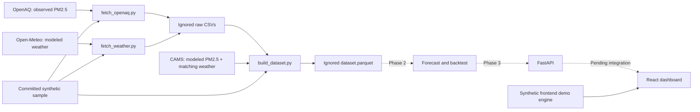
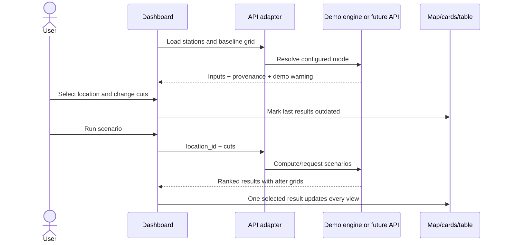

# Architecture

Air targets and weather retain separate provenance. Centroid weather is shared
across stations. Synthetic sample fallback is independent of API availability.
The React dashboard is implemented with a synthetic demo engine and an optional API
adapter. No server, trained forecast model, SHAP output, or real winter backtest exists yet.

## Implemented modules and boundaries

| Module | Responsibility | Does not do |
| --- | --- | --- |
| backend/app/config.py | AOI, paths, timezone, coverage threshold | HTTP serving or model loading |
| backend/scripts/common.py | HTTP retry/pagination, sample loading | Forecasting |
| backend/scripts/fetch_openaq.py | Sensor discovery and hourly target downloads | Provider coverage guarantees |
| backend/scripts/fetch_weather.py | Centroid archive weather | Archived operational weather forecasts |
| backend/scripts/build_dataset.py | Cleaning, weather merge, fallback and export | Feature engineering/training |
| frontend/src/types.ts | Canonical frontend response contract | Runtime validation of every field |
| frontend/src/lib/api.ts | Optional API calls and coherent initial fallback | A server implementation |
| frontend/src/mocks/engine.ts | Demo IDW, proxy shares, scenarios and illustrative series | Real source apportionment or ML |
| frontend/src/pages/Dashboard.tsx | Selection, tabs, result/loading/error state | A second scenario calculation |
| frontend/src/components/MapView.tsx | Layers, selection, tooltip and provenance rendering | New observations |
| frontend/src/components/ScenarioPanel.tsx | Sliders and ranked result presentation | Independent banner/map values |
| frontend/src/components/Charts.tsx | Forecast/backtest/source chart rendering | Accuracy fabrication |

## Dashboard state flow

Initial API failure swaps the complete input set to demo data. Once API inputs
have loaded, later analysis failures expose an error/retry state instead of
substituting synthetic results against real concentrations.

## Storage and deployment boundaries

The sample CSV is committed; generated raw CSVs, processed Parquet and future model
artifacts are ignored. Environment examples contain no secrets. Public Vite
configuration may contain the future API base URL, never provider credentials.

Vite's production build is static browser assets. The preserved prototype worker
supports static/Sites handoff; it is not the environmental FastAPI backend.
No public deployment or production service is configured by this repository.

## Planned evolution

Add leakage-safe Python features and model training before declaring forecasting.
Then implement Pydantic endpoints matching the contract, configured backend
spatial/scenario math, and integration tests. Keep SHAP feature explanations
separate from source-attribution hypotheses. Centralize backend weights and
assumptions when that engine is built; the current constants live in the demo file.
