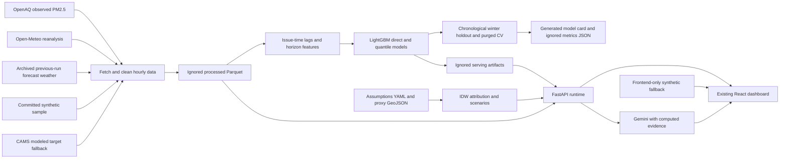

# Implemented architecture

## Runtime and storage

FastAPI initializes one dataset/model bundle before accepting requests. It loads
processed data or the sample; absent/mismatched artifacts trigger regeneration.
Training computes separate held-out models and refits serving models on all usable
data. Raw CSV, processed Parquet and joblib artifacts are ignored. The generated
model card is committed evidence; the sample stays under 1 MB.

Data are refreshed deliberately by rerunning the pipeline and restarting the
backend. The UI labels the data timestamp and warns about stale snapshots; there
is no hidden background polling, automatic alert service or public deployment.

## Module responsibilities

- `services/data_loader.py`: validated dataset source selection and fingerprint.
- `services/features.py`: hourly-axis lags, past rolling statistics, target calendar,
  wind/stagnation and issue-aligned forecast weather.
- `services/model.py`: direct LightGBM/quantiles, winter split, purged CV, metrics,
  generated card, serving and exact TreeSHAP groups.
- `services/spatial.py`: shared snapshot IDW, background, zone/weather proxies and
  synthetic population; all weights read from one YAML.
- `services/attribution.py`: total concentration shares, distinct from local weights.
- `services/scenarios.py`: one additive equation for selected location and full grid.
- `services/runtime.py`: coherent cached snapshot, model/reference selection and replay.
- `services/explainer.py`: actual-output context and Gemini with evidence checks; no canned fallback. Provider failures return explicit errors.
- `routers/`: validated FastAPI contract; unknown IDs/horizons/cuts return errors.
- `frontend/src/lib/api.ts`: backend requests, explicit initial synthetic fallback,
  subsequent retry states and replay parameters.

## Consistency boundaries

One scenario response drives the banner, cards, ranking and after-grid. Baseline
station markers stay at their shared snapshot readings. A historical replay reloads
the entire input set and uses its timestamp in every analysis request. Selecting a
grid cell uses nearest-station temporal history; validation assumptions disclose
that reference rather than invent independent cell accuracy.

## Explanation boundary

TreeSHAP groups explain model features. Proxy attribution estimates assumed source
shares. The explainer consumes both as separate context fields, alongside metrics
and scenarios. Without a key it returns a grounded summary. Provider failures or
new numeric literals trigger that fallback; checks do not prove every natural-
language claim is semantically correct.

## Deployment boundary

Vite assets are static; the preserved Sites worker is a frontend hosting adapter,
not FastAPI. Local development uses backend port 8000 and Vite port 5173. Provider
keys remain backend-only. There is no authentication/public service hardening or
production hosting claim in this prototype.
