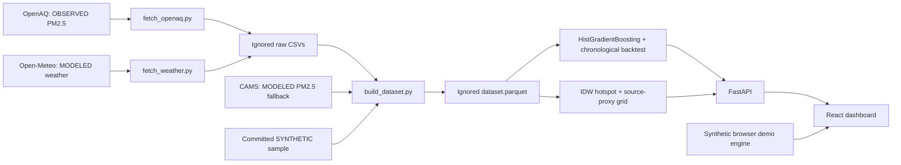
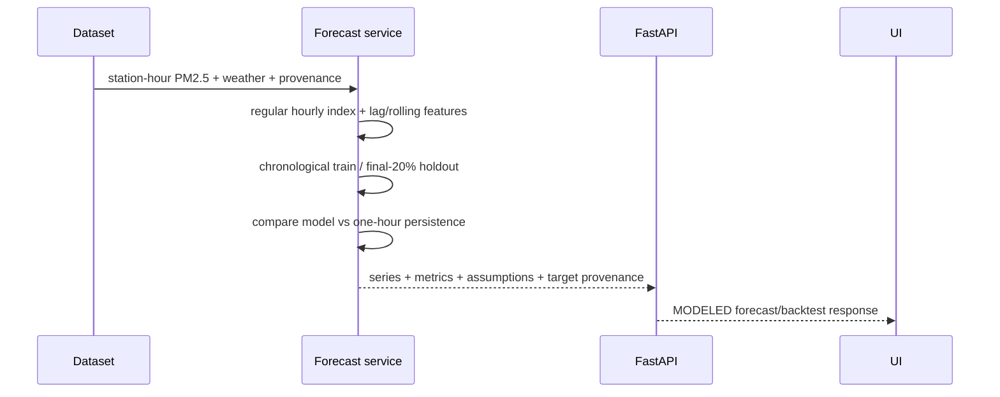

# Architecture

Air targets and weather retain separate provenance. The API loads
`data/processed/dataset.parquet` when available and otherwise uses the committed
synthetic sample. The browser can still run without the backend; setting
`VITE_API_BASE_URL` switches the frontend to the executable API contract.

## Implemented modules and boundaries

| Module | Responsibility | Does not do |
| --- | --- | --- |
| `backend/app/config.py` | AOI, paths, timezone, coverage threshold | Provider validation |
| `backend/scripts/fetch_openaq.py` | Observed PM2.5 discovery/download | Guarantee station coverage |
| `backend/scripts/fetch_weather.py` | Modeled centroid weather ingestion | Provide archived operational forecasts |
| `backend/scripts/build_dataset.py` | Cleaning, weather merge, fallback, Parquet export | Relabel modeled/synthetic targets as observed |
| `backend/app/services/forecasting.py` | Leakage-aware hourly features, gradient boosting, chronological backtest, recursive forecast | Claim observed accuracy from synthetic targets |
| `backend/app/services/twin.py` | IDW grid, source proxies, three intervention actions, population-weighted ranking | Chemical source apportionment or causal policy effects |
| `backend/app/main.py` | FastAPI routes, Pydantic request validation, CORS | Hide fallback provenance |
| `frontend/src/lib/api.ts` | API adapter + provenance guard + complete demo fallback | Recompute backend scenario math |
| `frontend/src/mocks/engine.ts` | Deterministic browser-only fallback | Real forecasting evidence |
| `frontend/src/pages/Dashboard.tsx` | Selection, tabs, result/loading/error state | Invent observations |

## Forecast and validation flow

The model predicts one hour ahead from information available at issue time.
24/48/72-hour views recursively roll the one-hour model forward. Future weather is
held at the latest available value and that assumption is returned in the API.
The residual p10/p90 band is diagnostic rather than a calibrated regulatory
confidence interval.

## Spatial/scenario flow

Latest station values feed a 12×12 inverse-distance grid. Traffic, industry and
construction/road-dust proxy weights combine approximate spatial anchors with
current wind/humidity/rain modifiers. Regional background is the 15th percentile
of latest station concentrations. Scenario cuts reduce only local excess above
background with a central pass-through of 0.70. Population remains SYNTHETIC and
is used only for relative exposure-benefit ranking.

## Dashboard state flow

Initial API failure swaps the complete input set to the deterministic browser
demo. Once API inputs have loaded, later analysis failures expose an error/retry
state instead of mixing synthetic scenario results with real concentrations.

## Storage and deployment boundaries

The sample CSV is committed; generated raw CSVs, processed Parquet and model
artifacts are ignored. Environment examples contain no secrets. Vite remains a
static frontend; FastAPI is a separate development service. No public production
deployment is configured by this repository.

## Next architecture priorities

Replace approximate source anchors with sourced spatial layers, record observed
provider coverage and holdout metrics, add archived/operational future-weather
inputs, and implement cache reload after the processed dataset is rebuilt.
